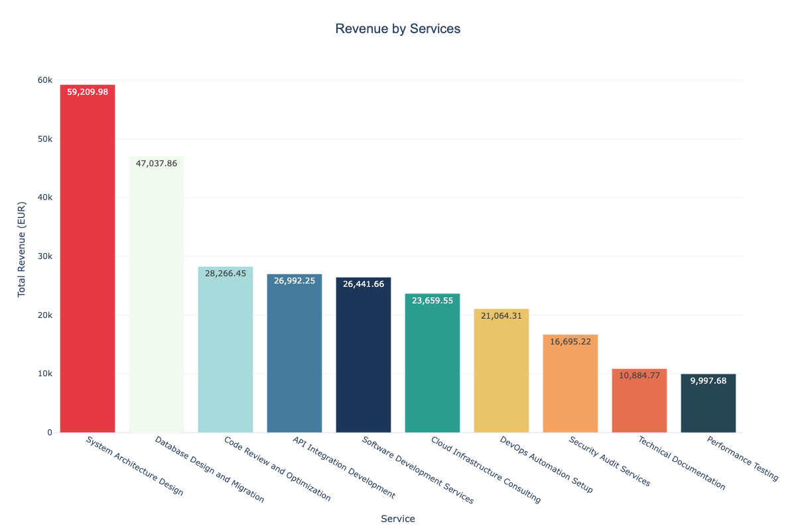

# Rossum MCP Server

<div align="center">

[](https://stancld.github.io/rossum-mcp/)
[](https://www.python.org/downloads/)
[](https://opensource.org/licenses/MIT)
[](https://modelcontextprotocol.io/)
[](https://github.com/rossumai/rossum-sdk)
[](https://codecov.io/gh/stancld/rossum-mcp)

</div>

A Model Context Protocol (MCP) server that provides tools for uploading documents and retrieving annotations using the Rossum API. Built with Python and the official [rossum-sdk](https://github.com/rossumai/rossum-sdk).

## Real-World Use Case 📊

Imagine you have a board meeting in 10 minutes ⏰ and you forgot to process 30 invoices for one of your contractors. You need an aggregation for them - **fast**. With Rossum MCP, you can:

1. 📤 **Upload all 30 invoices in bulk** to your Rossum queue
2. 🤖 **Wait for automatic processing** - AI extracts all data from every invoice
3. 📈 **Aggregate the data** - automatically sum up all line items across documents
4. 🎨 **Generate a presentable visualization** - create an interactive bar chart showing revenue by service

All of this happens in minutes, with a simple conversational prompt. No manual data entry, no spreadsheets, no panic. Just upload, process, and present. ✨

### Example: From Chaos to Chart 🚀

**This real-world example was achieved using the efficient Qwen 3 Next 80B A3B model.**

Starting from a folder full of unprocessed invoices:

```
/examples/data/
├── 📄 invoice_001.pdf
├── 📄 invoice_002.pdf
├── ...
└── 📄 invoice_030.pdf
```

With a single prompt (see [examples/PROMPT.md](examples/PROMPT.md)), the agent:
- ⬆️ Uploads all documents to Rossum
- 👀 Monitors processing status automatically
- 🔍 Extracts and aggregates line items by description
- 📊 Generates an interactive HTML chart ([`revenue.html`](revenue.html))

Result: You walk into your meeting with a professional visualization showing exactly how much revenue each service generated across all 30 invoices. 🎯

<div align="center">
  
</div>

The generated chart is fully interactive (built with Plotly) - hover over bars to see exact values, zoom, pan, and export as needed. Perfect for presentations. 💼

## Features

- **upload_document**: Upload a document to Rossum for processing
- **get_annotation**: Retrieve annotation data for a previously uploaded document
- **list_annotations**: List all annotations for a queue with optional filtering
- **get_queue**: Retrieve queue details including schema_id
- **get_schema**: Retrieve schema details and content
- **get_queue_schema**: Retrieve complete schema for a queue in a single call

## Prerequisites

- Python 3.10 or higher
- Rossum account with API credentials
- A Rossum queue ID

## Installation

1. Clone this repository or download the files

2. Install dependencies:
```bash
pip install -r requirements.txt
```

Or install as a package:
```bash
pip install -e .
```

3. Set up environment variables:
```bash
export ROSSUM_API_TOKEN="your-api-token"
export ROSSUM_API_BASE_URL="https://api.elis.rossum.ai/v1"  # or your organization's base URL
```

## Usage

### Running the MCP Server

Start the server using:
```bash
python server.py
```

### Using with MCP Clients

Configure your MCP client to use this server. For example, in Claude Desktop's config:

```json
{
  "mcpServers": {
    "rossum": {
      "command": "python",
      "args": ["/path/to/rossum-mcp/server.py"],
      "env": {
        "ROSSUM_API_TOKEN": "your-api-token",
        "ROSSUM_API_BASE_URL": "https://api.elis.rossum.ai/v1"
      }
    }
  }
}
```

### Using with Smolagents

The Python implementation makes it easy to use with smolagents, as both use Python and can share the `rossum_api` package:

```python
from smolagents import ToolCallingAgent, ManagedAgent

# Create a Rossum MCP agent
rossum_agent = ManagedAgent(
    agent=ToolCallingAgent(tools=[]),
    name="rossum",
    description="Upload and process documents using Rossum API"
)

# Use the agent
result = rossum_agent.run(
    "Upload the invoice.pdf to queue 12345 and wait for it to be processed"
)
```

### Available Tools

#### 1. upload_document

Uploads a document to Rossum for processing. Returns a task ID. Use `list_annotations` to get the annotation ID.

**Parameters:**
- `file_path` (string, required): Absolute path to the document file
- `queue_id` (integer, required): Rossum queue ID where the document should be uploaded

**Returns:**
```json
{
  "task_id": "12345",
  "task_status": "created",
  "queue_id": 12345,
  "message": "Document upload initiated. Use `list_annotations` to find the annotation ID for this queue."
}
```

#### 2. get_annotation

Retrieves annotation data for a previously uploaded document. Use this to check the status of a document.

**Parameters:**
- `annotation_id` (integer, required): The annotation ID obtained from list_annotations
- `sideloads` (array, optional): List of sideloads to include. Use `['content']` to fetch annotation content with datapoints

**Returns:**
```json
{
  "id": "12345",
  "status": "to_review",
  "url": "https://elis.rossum.ai/api/v1/annotations/12345",
  "schema": "67890",
  "modifier": "11111",
  "document": "22222",
  "content": [...],
  "created_at": "2024-01-01T00:00:00Z",
  "modified_at": "2024-01-01T00:00:00Z"
}
```

#### 3. list_annotations

Lists all annotations for a queue with optional filtering. Useful for checking the status of multiple uploaded documents.

**Parameters:**
- `queue_id` (integer, required): Rossum queue ID to list annotations from
- `status` (string, optional): Filter by annotation status (default: 'importing,to_review,confirmed,exported')

**Returns:**
```json
{
  "count": 42,
  "results": [
    {
      "id": "12345",
      "status": "to_review",
      "url": "https://elis.rossum.ai/api/v1/annotations/12345",
      "document": "67890",
      "created_at": "2024-01-01T00:00:00Z",
      "modified_at": "2024-01-01T00:00:00Z"
    }
  ]
}
```

#### 4. get_queue

Retrieves queue details including the schema_id. Use this to get the schema_id for use with get_schema.

**Parameters:**
- `queue_id` (integer, required): Rossum queue ID to retrieve

**Returns:**
```json
{
  "id": "12345",
  "name": "Invoices",
  "url": "https://elis.rossum.ai/api/v1/queues/12345",
  "schema_id": "67890",
  "workspace": "11111",
  "inbox": "22222",
  "created_at": "2024-01-01T00:00:00Z",
  "modified_at": "2024-01-01T00:00:00Z"
}
```

#### 5. get_schema

Retrieves schema details including the schema content/structure. Use get_queue first to obtain the schema_id.

**Parameters:**
- `schema_id` (integer, required): Rossum schema ID to retrieve

**Returns:**
```json
{
  "id": "67890",
  "name": "Invoice Schema",
  "url": "https://elis.rossum.ai/api/v1/schemas/67890",
  "content": [...]
}
```

#### 6. get_queue_schema

Retrieves the complete schema for a queue in a single call. This is the recommended way to get a queue's schema.

**Parameters:**
- `queue_id` (integer, required): Rossum queue ID

**Returns:**
```json
{
  "queue_id": "12345",
  "queue_name": "Invoices",
  "schema_id": "67890",
  "schema_name": "Invoice Schema",
  "schema_url": "https://elis.rossum.ai/api/v1/schemas/67890",
  "schema_content": [...]
}
```

### Annotation Status Workflow

When a document is uploaded, the annotation progresses through various states:

1. **importing** - Initial state after upload. Document is being processed.
2. **to_review** - Extraction complete, ready for user validation.
3. **reviewing** - A user is currently reviewing the annotation.
4. **confirmed** - The annotation has been validated and confirmed.
5. **exporting** - The annotation is being exported.
6. **exported** - Final state for successfully processed documents.

Other possible states include: `created`, `failed_import`, `split`, `in_workflow`, `rejected`, `failed_export`, `postponed`, `deleted`, `purged`.

**Important**: After uploading documents, agents should wait for annotations to transition from `importing` to `to_review` (or `confirmed`/`exported`) before considering them fully processed. Use `get_annotation` to poll individual annotations or `list_annotations` to check the status of multiple documents in bulk.

## Example Workflow

### Single Document Upload

1. Upload a document:
```
Use upload_document with:
- file_path: "/path/to/invoice.pdf"
- queue_id: "12345"
Response: { task_id: "67890", task_status: "created", message: "..." }
```

2. Get the annotation ID:
```
Use list_annotations with:
- queue_id: "12345"
Find your document in the results by creation time
```

3. Check annotation status:
```
Use get_annotation with:
- annotation_id: "67890" (from list_annotations)
Check status field - wait until it's "to_review", "confirmed", or "exported"
```

### Bulk Document Upload

For agents uploading multiple documents:

1. Upload all documents in bulk:
```
For each file:
  Use upload_document with file_path and queue_id
  Store returned task_ids
```

2. Check status of all annotations:
```
Use list_annotations with:
- queue_id: "12345"
- status: "to_review" (or check all statuses)
- ordering: "-created_at"

This returns all annotations in the queue, allowing you to verify which documents have finished processing.
```

## Error Handling

The server provides detailed error messages for common issues:
- Missing API token
- File not found
- Upload failures
- API errors

## License

MIT License - see LICENSE file for details

## Contributing

Feel free to submit issues and pull requests.

## Resources

- [Rossum API Documentation](https://elis.rossum.ai/api/docs/)
- [Model Context Protocol](https://modelcontextprotocol.io/)
- [Rossum SDK](https://github.com/rossumai/rossum-sdk)
