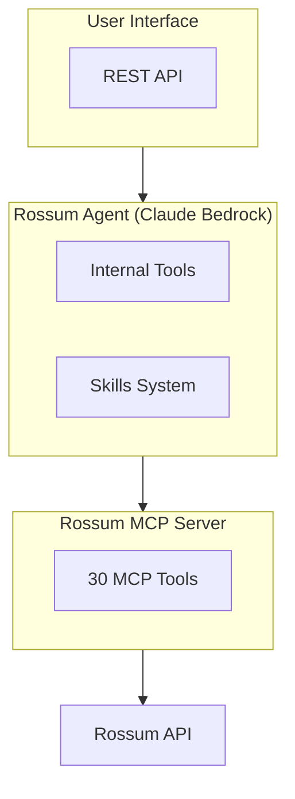

# Rossum Agent

<div align="center">

**AI agent for Rossum document processing. Debug hooks, deploy configs, and automate workflows conversationally.**

[](https://stancld.github.io/rossum-agents/)
[](https://pypi.org/project/rossum-agent/)
[](https://opensource.org/licenses/MIT)
[](https://pypi.org/project/rossum-agent/)
[](https://codecov.io/gh/stancld/rossum-agents)

[](https://github.com/rossumai/rossum-api)
[](https://modelcontextprotocol.io/)
[](https://www.anthropic.com/claude/opus)
[](https://github.com/astral-sh/ruff)
[](https://github.com/astral-sh/ty)
[](https://github.com/astral-sh/uv)

</div>

> [!NOTE]
> This is not an official Rossum project. It is a community-developed integration built on top of the Rossum API, not a product (yet).

## Features

| Capability | Description |
|------------|-------------|
| **Rossum MCP Integration** | Full access to 30 MCP tools for document processing |
| **Hook Debugging** | Test hooks via native Rossum API endpoints |
| **Deployment Tools** | Pull, push, diff, copy configs across environments |
| **Knowledge Base Search** | AI-powered Rossum documentation search |
| **Multi-Environment** | Spawn connections to different Rossum environments |
| **Skills System** | Load domain-specific workflows on demand |
| **Prompt Caching** | Automatic `cache_control` on system prompt, tools, and conversation history for up to 90% input token cost reduction (works on AWS Bedrock) |
| **Change Tracking** | Git-like config commit history with diffs, logs, and revert |

**Interfaces:** REST API, Python SDK

## Quick Start

```bash
# Set environment variables
export ROSSUM_API_TOKEN="your-api-token"
export ROSSUM_API_BASE_URL="https://api.elis.rossum.ai/v1"
export AWS_PROFILE="default"  # For Bedrock

# Run the agent API
uv pip install rossum-agent[api]
rossum-agent-api
```

## Installation

```bash
git clone https://github.com/stancld/rossum-agents.git
cd rossum-agents/rossum-agent
uv sync
```

**With extras:**
```bash
uv sync --extra all        # All extras (api, docs, tests)
uv sync --extra api        # REST API (FastAPI, PostgreSQL, Redis)
```

## Environment Variables

| Variable | Required | Description |
|----------|----------|-------------|
| `ROSSUM_API_TOKEN` | Yes | Rossum API authentication token |
| `ROSSUM_API_BASE_URL` | Yes | Base URL (e.g., `https://api.elis.rossum.ai/v1`) |
| `AWS_PROFILE` | Yes | AWS profile for Bedrock access |
| `AWS_REGION` | No | AWS region for Bedrock (default: `us-east-1`) |
| `AWS_BEDROCK_MODEL_ARN` | No | Custom ARN for the Opus model in Bedrock |
| `AWS_BEDROCK_MODEL_ARN_SMALL` | No | Custom ARN for the Haiku model in Bedrock |
| `POSTGRES_HOST` | No | PostgreSQL host for chat storage (default: `localhost`) |
| `POSTGRES_PORT` | No | PostgreSQL port (default: `5432`) |
| `POSTGRES_DB` | No | PostgreSQL database name (default: `rossum_agent`) |
| `POSTGRES_USER` | No | PostgreSQL user (default: `rossum`) |
| `POSTGRES_PASSWORD` | No | PostgreSQL password (default: `rossum`) |
| `REDIS_HOST` | No | Redis host for change tracking (default: `localhost`) |
| `REDIS_PORT` | No | Redis port for change tracking (default: `6379`) |
| `ROSSUM_MCP_MODE` | No | MCP mode: `read-write` (default) or `read-only` |
| `ROSSUM_AGENT_PERSONA` | No | Agent persona: `default` (default) or `cautious` — read by the TUI client, not the server |
| `ADDITIONAL_ALLOWED_ROSSUM_HOSTS` | No | Comma-separated regex patterns for additional allowed Rossum API hosts |
| `SLACK_BOT_TOKEN` | No | Slack bot token for report integration |
| `SLACK_CHANNEL` | No | Slack channel for posting reports |

## Usage

### REST API

```bash
# Development (uvicorn)
rossum-agent-api --host 0.0.0.0 --port 8000 --reload

# Production (gunicorn)
rossum-agent-api --server gunicorn --host 0.0.0.0 --port 8000 --workers 4
```

| Option | Server | Description |
|--------|--------|-------------|
| `--server` | both | Backend: `uvicorn` (default) or `gunicorn` |
| `--host` | both | Host to bind to (default: 127.0.0.1) |
| `--port` | both | Port to listen on (default: 8000) |
| `--workers` | both | Number of worker processes (default: 1) |
| `--reload` | uvicorn | Enable auto-reload for development |

### Python SDK

```python
import asyncio
from rossum_agent.agent import create_agent
from rossum_agent.rossum_mcp_integration import create_mcp_connection

async def main():
    mcp_connection = await create_mcp_connection()
    agent = await create_agent(mcp_connection=mcp_connection)

    async for step in agent.run("List all queues"):
        if step.final_answer:
            print(step.final_answer)

asyncio.run(main())
```

## Available Tools

The agent provides internal tools and access to 30 MCP tools via dynamic loading.

<details>
<summary><strong>Internal Tools</strong></summary>

**File & Working Memory:**
- `write_file` - Save reports, documentation, analysis results
- `search_knowledge_base` - Structured KB retrieval with deterministic ranking and sub-agent fallback
- `search_elis_docs` - AI-powered search of API documentation (sub-agent)

**Data Tools:**
- `run_jq` - Run jq expressions on JSON content or file paths
- `run_grep` - Regex search in text content or file paths

**Copilot Execution:**
- `execute_python` - Run constrained Python snippets; load the relevant skill first and use `write_file(...)` for large outputs. Allowed imports include `pandas` and `openpyxl`; use the built-in `read_excel(path)` helper to read `.xlsx`/`.xls` files into a DataFrame

**Schema:**
- `patch_schema_with_subagent` - Safe schema modifications via Opus

**Skills:**
- `load_skill` - Load domain-specific workflows (`schema-patching`, `python-execution`, `ui-settings`, `hooks`, `txscript`, `rules-and-actions`, `formula-fields`, `reasoning-fields`, `lookup-fields`, `master-data-hub`, `document-testing`, `automation-setup`, `customer-email`)

**Document Testing:**
- `generate_mock_pdf` - Generate schema-aware mock PDFs with realistic field values and optional header/row consistency checks for end-to-end extraction testing, while preserving explicit overrides

**Task Tracking:**
- `create_task` - Create a task to track progress on multi-step operations
- `update_task` - Update a task's status (`pending`, `in_progress`, `completed`) or subject
- `list_tasks` - List all tracked tasks with current status

**User Interaction:**
- `ask_user_question` - Ask the user structured questions (free-text or multiple-choice) mid-execution; streamed via `data-agent-question` event

</details>

<details>
<summary><strong>Dynamic MCP Tool Loading</strong></summary>

Tools are loaded on-demand to reduce context usage. Categories are auto-loaded based on keywords in the user's message:

| Category | Description |
|----------|-------------|
| `annotations` | Upload, retrieve, update, confirm documents |
| `queues` | Create, configure, list queues |
| `schemas` | Define, modify field structures |
| `engines` | Extraction and splitting engines |
| `hooks` | Extensions and webhooks |
| `email_templates` | Automated email responses |
| `document_relations` | Export/einvoice links |
| `relations` | Annotation relations |
| `rules` | Schema validation rules |
| `users` | User and role management |
| `workspaces` | Workspace management |

</details>

## Architecture



<details>
<summary><strong>REST API Endpoints</strong></summary>

| Endpoint | Description |
|----------|-------------|
| `GET /api/v1/health` | Health check |
| `GET /api/v1/chats` | List all chats |
| `POST /api/v1/chats` | Create new chat |
| `GET /api/v1/chats/{id}` | Get chat details |
| `DELETE /api/v1/chats/{id}` | Delete chat |
| `POST /api/v1/chats/{id}/messages` | Send message (AI SDK UI Message Stream v1) |
| `PUT /api/v1/chats/{id}/feedback` | Submit thumbs up/down for a turn |
| `GET /api/v1/chats/{id}/feedback` | Get all feedback for a chat |
| `DELETE /api/v1/chats/{id}/feedback/{turn}` | Remove feedback for a turn |
| `GET /api/v1/chats/{id}/files` | List files |
| `GET /api/v1/chats/{id}/files/{name}` | Download file |
| `GET /api/v1/commands` | List available slash commands |

API docs: `/api/docs` (Swagger) or `/api/redoc`

**Slash Commands:** Messages starting with `/` are intercepted before reaching the agent and return instant responses via the wire protocol. Available commands:

| Command | Description |
|---------|-------------|
| `/list-commands` | List all available slash commands |
| `/list-commits` | List configuration commits made in this chat |
| `/list-skills` | List available agent skills with slugs |
| `/list-mcp-tools` | List MCP tools grouped by category |
| `/list-agent-tools` | List built-in agent tools with descriptions |

The TUI provides autocomplete suggestions when typing `/`. Commands can also be discovered programmatically via `GET /api/v1/commands`.

**Streaming Events:** AI SDK UI Message Stream v1 compatible (`x-vercel-ai-ui-message-stream: v1`). Each line is `data: <json>\n\n` discriminated by `type`:

| Wire `type` | Description |
|-------------|-------------|
| `start` / `finish` | Stream lifecycle |
| `reasoning-start` / `reasoning-delta` / `reasoning-end` | Extended thinking blocks |
| `text-start` / `text-delta` / `text-end` | Text content blocks |
| `tool-input-start` / `tool-input-available` | Tool call begins and args ready |
| `tool-output-available` | Tool result |
| `error` | Agent execution error |
| `data-agent-question` | Structured question from agent |
| `data-task-snapshot` | Full task list snapshot |
| `data-file-created` | File created during agent run |

**MCP Mode:** Chat sessions support mode switching via the `mcp_mode` parameter:
- Set at chat creation: `POST /api/v1/chats` with `{"mcp_mode": "read-write"}`
- Override per message: `POST /api/v1/chats/{id}/messages` with `{"content": "...", "mcp_mode": "read-write"}`

**Persona:** Chat sessions support persona switching via the `persona` parameter:
- Set at chat creation: `POST /api/v1/chats` with `{"persona": "cautious"}`
- Override per message: `POST /api/v1/chats/{id}/messages` with `{"content": "...", "persona": "cautious"}`

</details>

## License

MIT License - see [LICENSE](../LICENSE) for details.

## Resources

- [Full Documentation](https://stancld.github.io/rossum-agents/)
- [API Reference](https://stancld.github.io/rossum-agents/api-reference/)
- [MCP Server README](../rossum-mcp/README.md)
- [Rossum API Documentation](https://rossum.app/api/docs/)
- [Main Repository](https://github.com/stancld/rossum-agents)
