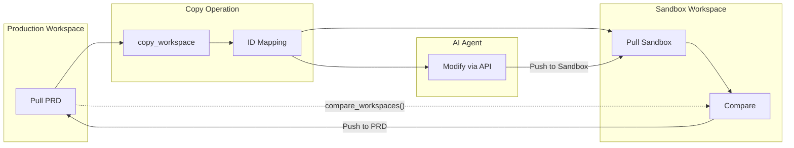

# Rossum Deploy

<div align="center">

[](https://stancld.github.io/rossum-mcp/)
[](https://www.python.org/downloads/)
[](https://opensource.org/licenses/MIT)
[](https://pypi.org/project/rossum-deploy/)

[](https://github.com/rossumai/rossum-api)
[](https://github.com/astral-sh/ruff)
[](https://github.com/astral-sh/uv)

</div>

Minimalistic pull/diff/push deployment for Rossum configurations.

> **Note**: This is a lightweight alternative to the [deployment-manager](https://github.com/rossumai/deployment-manager) (PRD2) tool.
> We aim to provide a simple, dependency-light solution for the [rossum-agent](../rossum-agent/) that covers core deployment workflows.

## Comparison with deployment-manager

| Feature | rossum-deploy | deployment-manager (PRD2) |
|---------|---------------|---------------------------|
| **Object Types** | 9 core types | All 16 types ✅ |
| **Commands** | pull, diff, push | pull, push, purge, deploy, init, hook (payload/test/sync), docommando, llm-chat |
| **Multi-target Deploy** | ✅ (copy_org + deploy) | ✅ (deploy to multiple orgs) |
| **Attribute Override** | ❌ | ✅ (regex-based overrides) |
| **3-way Merge** | ❌ | ✅ (conflict resolution) |
| **GIT Integration** | ✅ (tracks local changes) | ✅ (tracks staged/unstaged changes) |
| **Subdirectories** | ❌ | ✅ (dev/uat/prod structure) |
| **Secrets Management** | ❌ | ✅ (git-ignored secrets) |
| **LLM Documentation** | ✅ (via rossum-agent) | ✅ (docommando) |
| **Dependencies** | Minimal (pydantic, rossum-api) | Full (click, rich, questionary, etc.) |
| **API** | Python-first | CLI-first |

### Supported Object Types

`rossum-deploy` supports 9 core Rossum object types:

- **Core**: Workspace, Queue, Schema, Inbox
- **Automation**: Hook, Connector
- **Engine & AI**: Engine
- **Templates**: EmailTemplate
- **Rules**: Rule

> **Note**: `deployment-manager` supports additional types (Organization, Annotation, Document, RuleTemplate, Workflow, WorkflowStep, Task) for production deployments.

**When to use rossum-deploy:**
- Simple pull/push workflows within an AI agent
- Minimal dependency footprint required
- Programmatic access from Python code

**When to use deployment-manager:**
- Production deployments across multiple organizations
- Complex attribute overrides and conflict resolution
- GIT-based workflow tracking
- CLI-driven operations

## Installation

```bash
pip install -e rossum-deploy/
```

## Usage

### Python API

```python
from rossum_deploy import Workspace

# Initialize workspace
ws = Workspace(
    "./my-project",
    api_base="https://api.elis.rossum.ai/v1",
    token="your-token"
)

# Pull all objects from an organization
result = ws.pull(org_id=123456)
print(result.summary())

# Show diff between local and remote
diff = ws.diff()
print(diff.summary())

# Push changes (dry run first)
result = ws.push(dry_run=True)
print(result.summary())

# Push for real
result = ws.push()
print(result.summary())
```

### Full Example: Pull Org, Create Queue, and Add Hook

```python
from rossum_deploy import Workspace
from rossum_api import SyncRossumAPIClient
from rossum_api.dtos import Token

# Initialize client and workspace
api_base = "https://api.elis.rossum.ai/v1"
token = "your-api-token"

client = SyncRossumAPIClient(api_base, Token(token))
ws = Workspace("./my-rossum-project", api_base=api_base, token=token)

# 1. Pull existing organization configuration
org_id = 123456
result = ws.pull(org_id=org_id)
print(result.summary())
# Output:
# # Pull Summary
# - Pulled: 15
# - Skipped: 0
# ## Pulled
# - workspace: Main Workspace (111111)
# - queue: Invoices (222222)
# ...

# 2. Create a new queue using the Rossum API client
workspace_url = f"{api_base}/workspaces/111111"
schema = client.create_schema(name="New Queue Schema", content=[
    {
        "category": "section",
        "id": "invoice_section",
        "label": "Invoice Details",
        "children": [
            {
                "category": "datapoint",
                "id": "invoice_number",
                "label": "Invoice Number",
                "type": "string",
                "rir_field_names": ["invoice_id"]
            },
            {
                "category": "datapoint",
                "id": "total_amount",
                "label": "Total Amount",
                "type": "number",
                "rir_field_names": ["amount_total"]
            }
        ]
    }
])

queue = client.create_queue(
    name="My New Queue",
    workspace=workspace_url,
    schema=f"{api_base}/schemas/{schema.id}"
)
print(f"Created queue: {queue.name} (ID: {queue.id})")

# 3. Create a hook and attach it to the queue
hook = client.create_hook(
    name="Invoice Validation Hook",
    type="function",
    queues=[f"{api_base}/queues/{queue.id}"],
    events=["annotation_content.initialize"],
    config={
        "code": '''
def rossum_hook_request_handler(payload):
    """Validate invoice data on initialization."""
    messages = []

    for field in payload.get("annotation", {}).get("content", []):
        if field.get("schema_id") == "invoice_number":
            if not field.get("value"):
                messages.append({
                    "id": field["id"],
                    "type": "warning",
                    "content": "Invoice number is required"
                })

    return {"messages": messages}
''',
        "runtime": "python3.12"
    },
    sideload=["annotation"]
)
print(f"Created hook: {hook.name} (ID: {hook.id})")

# 4. Pull again to sync local state with new objects
result = ws.pull(org_id=org_id)
print(result.summary())

# 5. Check diff to verify everything is in sync
diff = ws.diff()
print(diff.summary())
# Output:
# # Diff Summary
# - Unchanged: 17
# - Local modified: 0
# - Remote modified: 0
# - Conflicts: 0
```

### CLI (Planned)

> **Note**: CLI support is planned but not yet implemented. Use the Python API for now.

```bash
# Future CLI commands (not yet available):
# rossum-deploy pull 123456
# rossum-deploy diff
# rossum-deploy push --dry-run
# rossum-deploy push
```

## Local File Structure

```
my-project/
├── workspaces/
│   └── {name}_{id}.json
├── queues/
│   └── {name}_{id}.json
├── schemas/
│   └── {name}_{id}.json
├── hooks/
│   └── {name}_{id}.json
├── inboxes/
│   └── {name}_{id}.json
└── .id_mapping_{source}_to_{target}.json  # Created by copy_org
```

## Cross-Organization Deployment

rossum-deploy supports a safe workflow for deploying changes from a sandbox to production.

### Step 1: Copy Production to Sandbox

```python
from rossum_deploy import Workspace

ws = Workspace("./my-project", api_base="...", token="...")

# Copy production config to sandbox (one-time setup)
result = ws.copy_org(
    source_org_id=123456,  # Production
    target_org_id=789012,  # Sandbox
)
print(result.summary())
```

This creates all objects in sandbox and saves an ID mapping file.

### Step 2: Agent Modifies Sandbox via API

The AI agent makes changes in sandbox using the Rossum API client.

### Step 3: Pull Sandbox and Review

```python
# Pull sandbox state
ws.pull(org_id=789012)

# Show diff
print(ws.diff().summary())
```

### Step 4: Deploy to Production

```python
# Dry run first
result = ws.deploy(target_org_id=123456, dry_run=True)
print(result.summary())

# Deploy for real after user approval
result = ws.deploy(target_org_id=123456)
print(result.summary())
```

## Workspace Comparison (Agent Workflow)

This is the **recommended workflow for AI agents** to safely develop and test changes before deployment.

### The Workflow

1. **Copy** a workspace to create an isolated sandbox
2. **Modify** the sandbox (agent makes changes via API)
3. **Pull** both original and modified workspaces
4. **Compare** to see exactly what changed

### Step 1: Copy Workspace to Sandbox

```python
from rossum_deploy import Workspace

ws = Workspace("./source-project", api_base="...", token="...")

# Copy a single workspace (and all its objects) to target org
result = ws.copy_workspace(
    source_workspace_id=111111,
    target_org_id=789012,  # Sandbox org
)
print(result.summary())
# Saves ID mapping: .id_mapping_123456_to_789012.json
```

### Step 2: Agent Modifies Sandbox

The AI agent makes changes in the sandbox using the Rossum API client:
- Modify schemas, hooks, rules
- Test changes with real documents
- Iterate until satisfied

### Step 3: Pull Both Workspaces

```python
# Pull original workspace into one directory
source_ws = Workspace("./source-workspace", api_base="...", token="...")
source_ws.pull_workspace(workspace_id=111111)

# Pull modified workspace into another directory
target_ws = Workspace("./target-workspace", api_base="...", token="...")
target_ws.pull_workspace(workspace_id=222222)  # The copied workspace ID
```

### Step 4: Compare Workspaces

```python
# Load the ID mapping from the copy operation
id_mapping = source_ws._load_id_mapping(
    source_org_id=123456,
    target_org_id=789012
)

# Compare source against target
comparison = source_ws.compare_workspaces(
    target_workspace=target_ws,
    id_mapping=id_mapping
)
print(comparison.summary())
```

Output:
```
# Workspace Comparison

Source workspace: 111111
Target workspace: 222222

- Identical: 8
- Different: 2
- Source only: 0
- Target only: 1

## Differences

### hook: Invoice Validation (source: 333333 → target: 444444)
  - **config**:
    - Source: {"code": "def validate()..."}
    - Target: {"code": "def validate_v2()..."}

### schema: Invoice Schema (source: 555555 → target: 666666)
  - **content**:
    - Source: [{"id": "invoice_number"...}]
    - Target: [{"id": "invoice_number"}, {"id": "po_number"...}]

## Target Only (not in source)
- rule: New Validation Rule (777777)
```

### Why This Workflow?

- **Safe**: Changes are made in an isolated sandbox, never touching production
- **Transparent**: Full diff shows exactly what the agent changed
- **Reversible**: Original workspace is untouched; discard sandbox if needed
- **Auditable**: Compare results can be reviewed before deployment

### Complete Example: Copy, Modify, Compare, and Push

This example demonstrates the full agent workflow: copy a workspace, make changes in the sandbox, compare against the original, and push changes.



```python
import os
from rossum_deploy import Workspace

ROSSUM_API_BASE_URL = "https://api.elis.rossum.ai/v1"
ROSSUM_API_TOKEN = "your-api-token"

# Source workspace to copy
source_workspace_id = 111111
target_org_id = 222222  # Can be same org for testing

# Create separate directories for source and target
source_dir = "./source-workspace"
target_dir = "./target-workspace"

os.makedirs(source_dir, exist_ok=True)
os.makedirs(target_dir, exist_ok=True)

# 1. Pull the source workspace
source_ws = Workspace(source_dir, api_base=ROSSUM_API_BASE_URL, token=ROSSUM_API_TOKEN)
source_ws.pull_workspace(source_workspace_id)
print(f"Pulled source workspace {source_workspace_id}")

# 2. Copy workspace to target org (creates sandbox copy)
copy_result = source_ws.copy_workspace(source_workspace_id, target_org_id)
print(f"Copied to new workspace: {copy_result.id_mapping.mappings['workspace']}")

# 3. Pull the copied target workspace
target_workspace_id = copy_result.id_mapping.mappings["workspace"][source_workspace_id]
target_ws = Workspace(target_dir, api_base=ROSSUM_API_BASE_URL, token=ROSSUM_API_TOKEN)
target_ws.pull_workspace(target_workspace_id)
print(f"Pulled target workspace {target_workspace_id}")

# 4. Make local modifications (e.g., edit a schema field)
# The agent would typically modify files in target_dir here
# For example: change a field's "hidden" property from false to true

# 5. Check local diff (what changed locally vs remote)
local_diff = target_ws.diff()
print(local_diff.summary(color=True))
# Output:
# # Diff Summary
# - Unchanged: 40
# - Local modified: 1
# - Remote modified: 0
# - Conflicts: 0
# - Local only: 0
#
# ## Local Changes (ready to push)
# ### schema: Invoice Schema (4071638)
# #### content
# -        "hidden": false,
# +        "hidden": true,

# 6. Compare source workspace against target (using ID mapping)
comparison = source_ws.compare_workspaces(target_ws, copy_result.id_mapping)
print(comparison.summary(color=True))
# Output:
# # Workspace Comparison
# Source workspace: 111111
# Target workspace: 333333
# - Identical: 30
# - Different: 1
# - Source only: 0
# - Target only: 0
#
# ## Differences
# ### schema: Invoice Schema (source: 123456 → target: 789012)
# #### content
# -        "hidden": false,
# +        "hidden": true,

# 7. Push changes to remote (after review/approval)
push_result = target_ws.push()
print(push_result)
# Output: PushResult(pushed=[(<ObjectType.SCHEMA: 'schema'>, 4071638, 'Invoice Schema')], skipped=[], failed=[])

# 8. Verify everything is in sync
final_diff = target_ws.diff()
print(final_diff.summary())
# Output:
# # Diff Summary
# - Unchanged: 41
# - Local modified: 0
# - Remote modified: 0
# - Conflicts: 0
# - Local only: 0
```

**Key Points:**

1. **ID Mapping**: The `copy_result.id_mapping` tracks which source objects map to which target objects
2. **Two types of diff**:
   - `ws.diff()` - compares local files vs remote API (for push/pull workflow)
   - `ws.compare_workspaces()` - compares two workspaces using ID mapping (for sandbox comparison)
3. **Isolated changes**: All modifications happen in the target sandbox; source is never touched
4. **Push when ready**: After reviewing the comparison, push changes to persist them

## Safety

- Use `dry_run=True` to preview changes before pushing or deploying
- Conflicts detected when both local and remote changed
- Use `force=True` to override conflicts
- ID mapping automatically handles cross-org references

## Git Integration

rossum-deploy automatically uses Git when available to detect **conflicts**
(when both local and remote changed). Without Git, conflict detection is disabled
but pull/diff/push still work normally.


## See Also

- [deployment-manager (PRD2)](https://github.com/rossumai/deployment-manager) - Full-featured deployment tool
- [rossum-agent](../rossum-agent/) - AI agent that uses rossum-deploy
- [rossum-mcp](../rossum-mcp/) - MCP server for Rossum API
