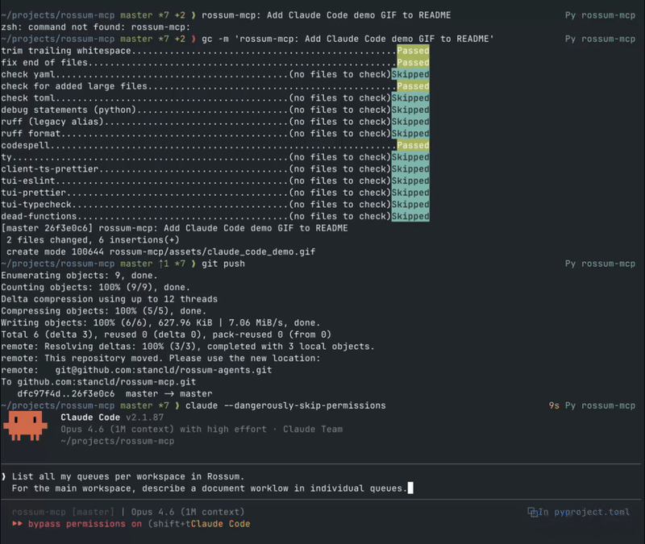

# Rossum MCP Server

<div align="center">

**MCP server for AI-powered Rossum document processing. Fully typed tools with Pydantic models, StrEnum parameters, and unified APIs — built for agents.**

[](https://stancld.github.io/rossum-agents/)
[](https://pypi.org/project/rossum-mcp/)
[](https://opensource.org/licenses/MIT)

[](https://pypi.org/project/rossum-mcp/)

[](https://codecov.io/gh/stancld/rossum-agents)
[](https://github.com/stancld/rossum-agents/actions/workflows/codeql.yaml)
[](https://github.com/stancld/rossum-agents/actions/workflows/snyk.yaml)
[](https://www.codefactor.io/repository/github/stancld/rossum-agents)

[](https://modelcontextprotocol.io/)
[](#available-tools)
[](https://github.com/rossumai/rossum-api)
[](https://github.com/astral-sh/ruff)
[](https://github.com/astral-sh/ty)
[](https://github.com/astral-sh/uv)

</div>

> [!NOTE]
> This is not an official Rossum project. It is a community-developed integration built on top of the Rossum API, not a product (yet).

## Demo

Rossum MCP in action with Claude Code:



## Quick Start

Set the required environment variables:

```bash
export ROSSUM_API_TOKEN="your-api-token"
export ROSSUM_API_BASE_URL="https://api.elis.rossum.ai/v1"
```

Then use the installed package or run from source.

Install and run:

```bash
uv pip install rossum-mcp
rossum-mcp
```

Or run from source:

```bash
git clone https://github.com/stancld/rossum-agents.git
cd rossum-agents/rossum-mcp

uv sync
python -m rossum_mcp.run
```

## Claude Desktop Configuration

Configure Claude Desktop (`~/Library/Application Support/Claude/claude_desktop_config.json` on Mac):

```json
{
  "mcpServers": {
    "rossum": {
      "command": "uvx",
      "args": ["rossum-mcp"],
      "env": {
        "ROSSUM_API_TOKEN": "${ROSSUM_API_TOKEN}",
        "ROSSUM_API_BASE_URL": "${ROSSUM_API_BASE_URL}",
        "ROSSUM_MCP_MODE": "read-write"
      }
    }
  }
}
```

## Environment Variables

| Variable | Required | Description |
|----------|----------|-------------|
| `ROSSUM_API_TOKEN` | Yes | Your Rossum API authentication token |
| `ROSSUM_API_BASE_URL` | Yes | Base URL for the Rossum API |
| `ROSSUM_MCP_MODE` | No | `read-write` (default) or `read-only` |
| `ROSSUM_MCP_LOG_LEVEL` | No | Logging level (default: `INFO`) |

### Read-Only Mode

Set `ROSSUM_MCP_MODE=read-only` to disable all CREATE, UPDATE, DELETE, and UPLOAD operations. Only GET and LIST operations will be available.

To change the mode, restart the server with a different `ROSSUM_MCP_MODE` environment variable.

## Available Tools

Fully typed with Pydantic models, `StrEnum` parameters, and unified APIs — 30 tools across 13 categories.

<details>
<summary><strong>All 30 tools</strong></summary>

| Category | Tools |
|----------|-------|
| Read | `get` · `search` |
| Delete | `delete` |
| Documents | `upload_document` · `get_annotation_content` · `start_annotation` · `bulk_update_annotation_fields` · `confirm_annotation` · `copy_annotations` |
| Queues | `create_queue_from_template` · `update_queue` |
| Schemas | `patch_schema` · `get_schema_tree_structure` · `prune_schema_fields` |
| Engines | `create_engine` · `update_engine` · `create_engine_field` · `get_engine_fields` |
| Hooks | `create_hook` · `update_hook` · `create_hook_from_template` · `test_hook` |
| Rules | `create_rule` · `patch_rule` |
| Workspaces | `create_workspace` |
| Users | `create_user` · `update_user` |
| Email | `create_email_template` |
| Mode | `get_mcp_mode` |
| Discovery | `list_tool_categories` |

</details>

For parameters and examples, see [TOOLS.md](TOOLS.md).

## Example Workflows

### Upload and Monitor

```python
# 1. Upload document
upload_document(file_path="/path/to/invoice.pdf", queue_id=12345)

# 2. Get annotation ID
annotations = search(query={"entity": "annotation", "queue_id": 12345, "ordering": ["-created_at"]}, first_n=1)

# 3. Check status
annotation = get(entity="annotation", entity_id=annotations[0]["id"])
```

### Update Fields

```python
# 1. Start annotation (moves to 'reviewing')
start_annotation(annotation_id=12345)

# 2. Get content with field IDs
annotation_content = get_annotation_content(annotation_id=12345)
# Returns {"path": "/tmp/rossum_annotation_12345_content.json"} — use jq/grep on that file

# 3. Update fields using datapoint IDs
bulk_update_annotation_fields(
    annotation_id=12345,
    operations=[{"op": "replace", "id": 67890, "value": {"content": {"value": "INV-001"}}}]
)

# 4. Confirm
confirm_annotation(annotation_id=12345)
```

## License

MIT License - see [LICENSE](../LICENSE) for details.

## Resources

- [Tools Reference](TOOLS.md)
